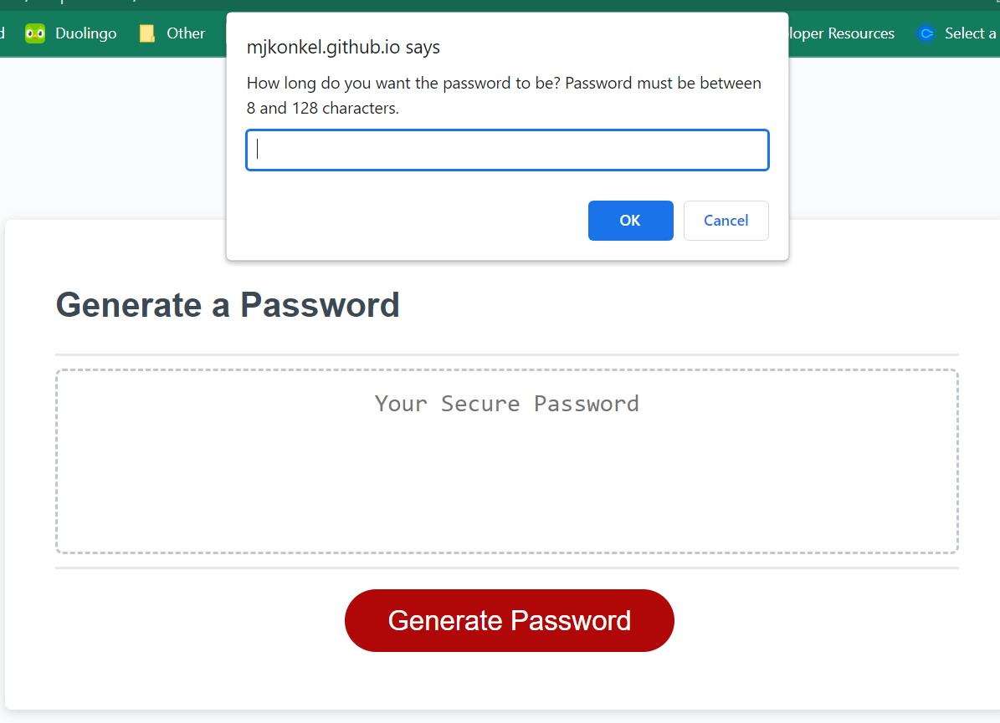
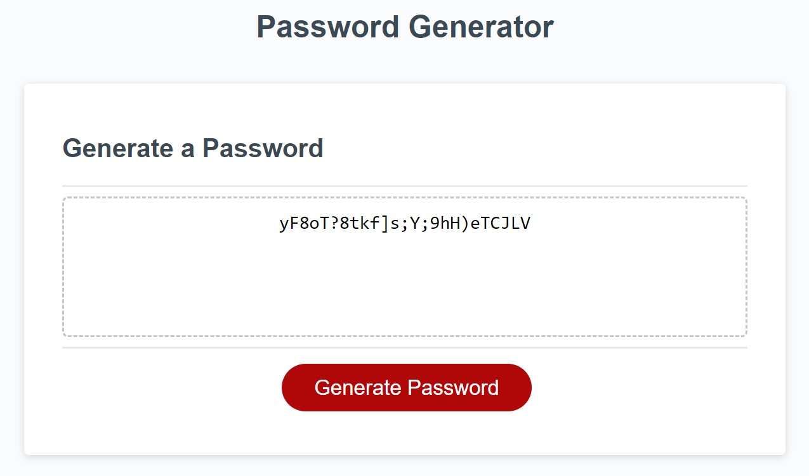

# Challenge 3 - Create a Password Generator

## Description

This repo contains code for the Password Generator challenge of the bootcamp. In the process of making this application, I was able to practice the JavaScript I have been learning in class. We have been learning basic JavaScript and this was an opportunity to incorporate several different concepts into a single project. Some JavaSCript concepts I included in this project are: for loops, functions, and if statements.

## Installation

N/A
 
## Usage

[Link to deployed website.](https://mjkonkel.github.io/C3-password/)

> To begin generating a password, click the Generate Password button at the bottom of the screen.

> The site will then prompt you to enter the length of the password and select which types of characters you would like to have in the password.

> Once all choices have been made, the password will display in the middle of the screen.

## License

Please refer to the license in the repo.
